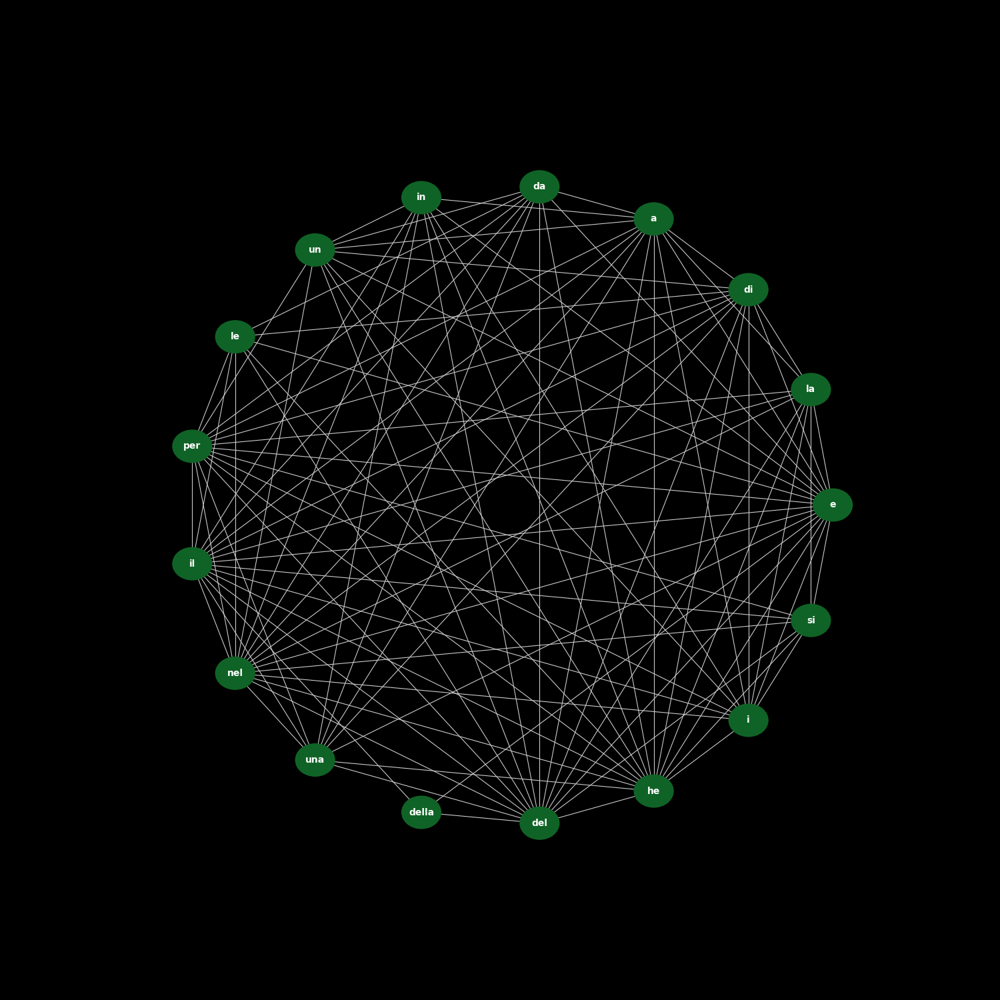

# Wikipedia Article Analyzer Using Zipf's Law

This project downloads and analyzes Wikipedia articles in the selected language. The main focus of the program is to examine word frequency distributions based on **Zipf's Law**, identify word neighbors, and generate a graphical representation of word relationships within a specified percentage range. The project concludes by creating a detailed PDF report, including the analysis and graphs.

## Features

1. **Download and Preprocessing**:
   - The program downloads Wikipedia articles by wikipedia-api in the selected language using the `articklesDownloaderSorter.py` script.
   - Each word's frequency is calculated, and articles are processed to sort and clean the text.

2. **Zipf's Law Analysis**:
   - Using the principle of **Zipf's Law**, the program generates a frequency ranking of words in the articles.
   - A word rank table is created, showing how often each word appears and its adherence to Zipf's Law.

3. **Word Neighbors Graph**:
   - The program checks for word neighbors in the articles and creates a list of connected words.
   - A graph of word connections is generated, representing the relationships between words based on proximity in the text. This graph can be filtered by a specific percentage range of word importance or frequency.

4. **PDF Report Generation**:
   - The final step of the process generates a PDF report using **ReportLab** (`PDFgenerator.py`), which includes:
     - Word rank and frequency tables.
     - Graphical representation of word relationships.
     - Insights on how well Zipf's Law holds for the analyzed articles.
     - A summary of the text coverage, showing how many words are needed to cover a specific percentage of the text.
     - Example: A PDF report like `zipf_law_results_table_spaced.pdf` includes such information (as seen in the sample).

## Installation

To run the project, ensure you have the following dependencies installed:

- Python 3.x
- Matplotlib (for graph generation)
- **ReportLab** (for PDF report generation)
- Networkx (for graph processing)
- Requests (for article downloads)

You can install them via pip:
```
pip install matplotlib networkx requests reportlab
```
## Usage

### Running the Full Analysis

**Run the Main Sequence:**  
The entire sequence of downloading, processing, analyzing, and generating output is orchestrated by `main.py`. This script ensures that all modules run in the correct order.
```
python main.py
```

Download Articles:
Use the articklesDownloaderSorter.py script to download and preprocess Wikipedia articles.
```
python articklesDownloaderSorter.py
```

Run the Exporter:
The core analytics, including Zipf's law analysis and the generation of word rankings and graphs, are handled by the exporter.py file. To run the analysis directly:
```
python exporter.py
```

Generate Graph:
The graphGenerator.py script generates the word relationship graph. You can specify the percentage range of words to include.
```
python graphGenerator.py
```

Generate PDF:
The PDFgenerator.py script creates a final report, including all the analysis and the word graph, using ReportLab for PDF generation.
```
python PDFgenerator.py
```

## Example Output

Here’s an example of the word frequency analysis result in French(based on Zipf's Law):

| Word | Rank | Frequency | Rank * Frequency |
| ---- | ---- | --------- | ---------------- |
| di   | 1    | 4119      | 4119             |
| e    | 2    | 2537      | 5074             |
| il   | 3    | 1988      | 5964             |
| la   | 4    | 1925      | 7700             |

## Graph Example

A connection graph of word relationships (as seen in the image below) is generated based on neighbor proximity within the text.



## PDF Report Sample

A PDF report, such as [zipf_law_results_table_spaced.pdf](./zipf_law_results_table_spaced.pdf), contains detailed insights into the word frequency analysis and graph information, showing how well Zipf's Law holds and text coverage.


## License

This project is open-source, licensed under the MIT License.
